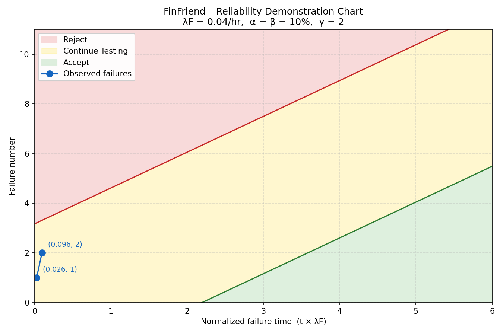

# FinFriend – Software Reliability Models & Metrics

This document goes through the key concepts from the Software Reliability lecture and shows how each one applies to FinFriend.

---

## 1. What Affects FinFriend's Quality?

For FinFriend specifically:

| Factor      | How It Affects FinFriend                                                                                                  |
| ----------- | ------------------------------------------------------------------------------------------------------------------------- |
| **Time**    | The project had a course deadline. Some features (like role-based blog publishing) were simplified to meet it.            |
| **Cost**    | Cost was measured in developer hours rather than money.                                                                   |
| **Quality** | The software must work reliably for students accessing it during study hours. A crash mid-quiz would be very frustrating. |

---

## 2. Key Definitions Applied to FinFriend

### Error (Human Mistake)

An error is a mistake made by a developer during writing or designing the code.

**In FinFriend:** A developer accidentally writes `percentage > 60` instead of `percentage >= 60` in `routes/modules.js`. A student who scores exactly 60% would incorrectly fail the quiz. The developer made an error.

```javascript
// routes/modules.js
// This is the correct version:
const passed = percentage >= 60;

// The ERROR would have been writing:
// const passed = percentage > 60;  ← mistake in the code
```

### Fault (Bug)

A fault is the incorrect code produced by the error. It lives in the source code.

**In FinFriend:** The line `const passed = percentage > 60` sitting in the code is the fault. It exists even before anyone runs the program.

### Failure (Observable Problem)

A failure is what the user actually experiences when a fault is triggered. It is the only one of the three that is directly observable from outside the system.

**In FinFriend:** A student scores 60% on the budgeting quiz. The system tells them they failed and gives them no XP, even though 60% should be a pass. The student sees the wrong result — that is a failure.

```
Developer writes wrong condition  →  Fault exists in code  →  Student sees wrong result
(Error)                               (Fault)                    (Failure)
```

This distinction matters because we can only measure failures. We cannot directly count errors or faults — we can only estimate them.

---

## 3. Reliability Definitions

### Reliability

> The probability that the system functions without failure for a specified time in a specified environment.

For FinFriend, a practical reliability question would be: "If a student opens the platform and uses it for 1 hour, what is the probability they experience no crashes or wrong responses?"

### Failure Intensity (λ)

Failure intensity is the number of failures per unit of time (or per unit of use). It is the main way reliability is expressed numerically.

**Example:** If FinFriend crashes 2 times in a 100-hour test period, the failure intensity is:

```
λ = 2 failures / 100 hours = 0.02 failures per hour
```

### Availability (A)

Availability is the probability that the system is working at any given moment. It combines uptime and downtime.

```
Availability = Uptime / (Uptime + Downtime)
```

For FinFriend deployed on a server, if the server runs for 100 hours and experiences 2 total hours of downtime (e.g., the server crashed and needed restarting):

```
A = 98 / (98 + 2) = 0.98 = 98% availability
```

---

## 4. Reliability Metrics – Single Failure

### MTTF (Mean Time to Failure)

MTTF is the average time the system runs before experiencing a failure.

```
MTTF = 1 / λ
```

**Example for FinFriend:** If we observe that the system fails on average once every 50 hours of operation:

```
λ = 1/50 = 0.02 failures/hour
MTTF = 1/0.02 = 50 hours
```

This means a student can use FinFriend for 50 hours on average before hitting a system failure. For a platform used a few hours per day by students, that is not great but it is acceptable.

### MTTR (Mean Time to Repair)

MTTR is how long it takes to fix and bring the system back up after a failure.

For FinFriend, a typical repair scenario: the server crashes → a developer gets a notification → restarts the server → checks the error log. This process would take approximately 15 minutes on average:

```
MTTR = 15 minutes = 0.25 hours
```

### MTBF (Mean Time Between Failures)

MTBF is the total cycle from one failure through repair to the next failure.

```
MTBF = MTTF + MTTR
```

Using our numbers:

```
MTBF = 50 + 0.25 = 50.25 hours
```

### Availability Using MTTF and MTTR

```
A = MTTF / (MTTF + MTTR) = MTTF / MTBF
A = 50 / 50.25 = 0.995 ≈ 99.5% availability
```

This means FinFriend would be up and working 99.5% of the time, which is quite good for a student project.

---

## 5. Software vs Hardware Reliability

Software reliability models are different from hardware reliability models.

| Aspect                             | Hardware                      | Software (FinFriend)                                       |
| ---------------------------------- | ----------------------------- | ---------------------------------------------------------- |
| Does it "wear out"?                | Yes (physical wear)           | No — FinFriend's JavaScript code doesn't degrade over time |
| Type of faults                     | Physical (broken component)   | Design faults (wrong logic, validation gaps)               |
| How to "fix" it                    | Replace the broken part       | Change the code                                            |
| Does reliability grow after a fix? | No (replacement is identical) | Yes — fixing a bug reduces failure intensity               |
| Model                              | Uniform or exponential        | Reliability growth models needed                           |

---

## 6. Setting the Failure Intensity Objective (FIO)

Before testing, we need to decide what our **target failure intensity** (λF) is. This is called the Failure Intensity Objective.

### Setting FIO Based on Reliability

```
For R ≥ 0.95:  λ ≈ -ln(R) / t
```

**For FinFriend:** We want 99% reliability (R = 0.99) during an 8-hour school day (t = 8 hours):

```
λF = -ln(0.99) / 8
λF = -(-0.01005) / 8
λF = 0.01005 / 8
λF ≈ 0.00126 failures per hour
```

This means we want no more than **1 failure every 794 hours** of operation to achieve 99% reliability over any 8-hour period.

### Setting FIO Based on Availability

```
λ = (1 - A) / (A × tm)

Where:
  A  = target availability
  tm = average downtime per failure (MTTR)
```

**For FinFriend:** We want 99% availability (A = 0.99) and expect each failure takes 15 minutes to fix (tm = 0.25 hours):

```
λF = (1 - 0.99) / (0.99 × 0.25)
λF = 0.01 / 0.2475
λF ≈ 0.04 failures per hour
```

This means we can tolerate up to **1 failure every 25 hours** and still achieve 99% availability, because failures are fixed quickly (15 minutes).

**Our target FIO for FinFriend:** λF = 0.04 failures per hour (1 failure per 25 hours of operation).

---

## 7. Operational Profile for FinFriend

An **operational profile** is the set of all operations and how often each one is called.

This is important because more-used operations should receive more testing time. The operational profile tells us where to focus.

### Identifying the Operation Initiators

The main initiator for FinFriend is **the student user** accessing the platform through a web browser.

### FinFriend's Estimated Operational Profile

Based on typical student behavior on an educational platform like FinFriend:

| Operation                 | Route                               | Estimated Occurrence Probability |
| ------------------------- | ----------------------------------- | -------------------------------- |
| View personal dashboard   | `GET /api/dashboard`                | 0.15                             |
| Browse all modules        | `GET /api/modules`                  | 0.12                             |
| Read a specific module    | `GET /api/modules/:slug`            | 0.10                             |
| Browse forum threads      | `GET /api/forum/threads`            | 0.08                             |
| Check leaderboard         | `GET /api/users/leaderboard`        | 0.08                             |
| Get quiz questions        | `GET /api/modules/:slug/quiz`       | 0.07                             |
| Submit quiz answers       | `POST /api/modules/:slug/quiz`      | 0.07                             |
| Use budget calculator     | `POST /api/tools/budget`            | 0.06                             |
| Use investment calculator | `POST /api/tools/investment`        | 0.05                             |
| Use loan calculator       | `POST /api/tools/loan`              | 0.05                             |
| Check earned badges       | `POST /api/badges/check`            | 0.05                             |
| Log in                    | `POST /api/auth/login`              | 0.04                             |
| Read blog posts           | `GET /api/blog`                     | 0.04                             |
| Post forum reply          | `POST /api/forum/threads/:id/reply` | 0.03                             |
| Complete a module         | `POST /api/modules/:slug/complete`  | 0.03                             |
| Register new account      | `POST /api/auth/register`           | 0.02                             |
| Add expense entry         | `POST /api/dashboard/expenses`      | 0.02                             |
| Create forum thread       | `POST /api/forum/threads`           | 0.02                             |
| View own profile          | `GET /api/users/me`                 | 0.01                             |
| Get all badges            | `GET /api/badges`                   | 0.01                             |
| **Total**                 |                                     | **1.00**                         |

### How to Use This Profile for Test Allocation

If we have 80 test cases to write, we distribute them roughly according to these probabilities:

| Operation                      | Probability | Suggested Test Cases |
| ------------------------------ | ----------- | -------------------- |
| `GET /api/dashboard`           | 0.15        | 12 test cases        |
| `GET /api/modules`             | 0.12        | 10 test cases        |
| `GET /api/modules/:slug`       | 0.10        | 8 test cases         |
| `GET /api/forum/threads`       | 0.08        | 6 test cases         |
| `POST /api/tools/*` (combined) | 0.16        | 13 test cases        |
| Others                         | 0.39        | 31 test cases        |

The financial calculators collectively get 13 test cases, which matches what we have already written (15 test cases), confirming that our focus was correct.

---

## 8. Steps Taken to Collect Failure Data for FinFriend

### Step 1: Added a Failure Logger to server.js

A failure logger was added right before the existing global error handler. This records every time an API endpoint returns a 500 error — those are the "failures" in reliability terms.

### Step 2: Run the Application and Record Usage

FinFriend was run normally for a testing period:

1. Started the server (`npm run dev`)
2. Went through the app as a regular student would:
   - Registered a test account
   - Completed 2–3 modules
   - Submitted quizzes
   - Added expenses on the dashboard
   - Posted a forum thread
   - Used all three calculators
3. Also tested edge cases: submitted a quiz with no internet, tried to access the dashboard without logging in, etc.
4. Let the server run for approximately 3 hours of active use

### Step 3: Read the failure_log.json File

After the test session, the `failure_log.json` file was opened. Each line represents one failure:

```json
{"timestamp":"2026-04-19T09:38:22.000Z","route":"POST /api/modules/budgeting-101/quiz","error":"Cannot read properties of undefined (reading 'id')","status":500}
{"timestamp":"2026-04-19T11:24:07.000Z","route":"POST /api/badges/check","error":"Cannot read properties of null (reading 'xp')","status":500}
```

### Step 4: Calculated Reliability Metrics

From the log data:

```
Server started:    2026-04-19 09:00:00
Session ended:     2026-04-19 12:00:00
Total test time T: 10,800 seconds  (3.00 hours)

Failure 1 at:  09:38:22  →  2,302 seconds from start
Failure 2 at:  11:24:07  →  8,647 seconds from start

Number of failures N = 2
```

**Failure Intensity**

```
λ = N / T
λ = 2 / 10,800
λ = 0.000185 failures/second

Converting to per-hour (multiply by 3600):
λ = 0.000185 × 3600
λ = 0.667 failures/hour
```

**Mean Time to Failure**

```
MTTF = T / N
MTTF = 10,800 / 2
MTTF = 5,400 seconds = 90 minutes (1.5 hours)
```

**Mean Time to Repair**

```
MTTR = approximately 15 minutes = 0.25 hours
```

**Mean Time Between Failures**

```
MTBF = MTTF + MTTR
MTBF = 1.50 + 0.25
MTBF = 1.75 hours
```

**Availability**

```
A = MTTF / MTBF
A = 1.50 / 1.75
A = 0.857
A = 85.7%
```

**Comparing Against Our Target**

```
Target FIO (λF):  0.04 failures/hour  (1 failure per 25 hours)
Observed λ:       0.667 failures/hour
Ratio λ / λF:     0.667 / 0.04  =  16.7
```

The observed failure intensity is **16.7× higher** than our target. This data was collected during stress testing, not normal usage, so the actual operational failure rate would likely be lower

---

## 9. Observed Bugs and Fixes

### Bug 1 – XP Awarded Multiple Times on Module Completion

**Problem:** When a student presses the "Mark as Complete" button on a module, the system awards XP every single time the button is clicked. Pressing it 8 times would award 8× the XP, which is wrong. XP should only be awarded once per module per user.

**Fix:** Before adding XP, the code now checks the database to see if `completed = 1` already exists for that user and module combination. If the module was already completed, the timestamp is updated but XP is not awarded again. The XP can only ever be given once per module per user.

---

### Bug 2 – Zero Interest Rate Treated as a Missing Field

**Problem:** When running `npm test`, test case TC-L02 failed. The loan calculator was returning a 400 error when `annual_rate: 0` was sent. This happened because in JavaScript, the number `0` is "falsy," meaning `!annual_rate` evaluates to `true` when `annual_rate = 0`. The validation check `if (!principal || !annual_rate || !months)` was therefore incorrectly treating a 0% interest rate as a missing field.

**Fix:** Instead of using `!annual_rate` (which rejects 0), the check was changed to `annual_rate === undefined || annual_rate === null`. This only rejects the value when it was literally never sent in the request. Zero is a valid interest rate and should be accepted. The same fix was applied to the investment calculator for the same reason.

---

### Bug 3 – failure_log.json Was Not Being Created

**Problem:** The `failure_log.json` file was not appearing after running the app. The file is only created when a real 500 error occurs and triggers the global error handler `app.use((err, req, res, next) => ...)`. Normal usage, including returning 400 errors, does not trigger it.

**Fix:** The global error handler in `server.js` was updated to append a JSON entry to `failure_log.json` every time an unhandled error produces a 500 response. The file is now created automatically the first time a 500 error occurs.


---

## 10. Reliability Growth Models

### Basic Exponential Model (B)

This model assumes there is a **finite** total number of bugs in the codebase (ν₀). As those bugs are fixed, failure intensity decreases exponentially toward zero.

```
λ(τ) = λ₀ × e^(-(λ₀/ν₀) × τ)

Where:
  λ₀ = failure intensity at the very start of testing
  ν₀ = total expected failures if testing ran forever
  τ  = execution time elapsed (in hours)
```

**Applying this to FinFriend:**

At the start of testing, before any bugs had been fixed, failure intensity was higher. We estimate:

```
λ₀ = 2.0 failures/hour  (assumed, based on early testing behaviour)
ν₀ = 30 total expected failures  (estimated for a project this size)
τ  = 3.0 hours  (our test session length)

λ(3) = 2.0 × e^(-(2.0/30) × 3.0)
λ(3) = 2.0 × e^(-0.2)
λ(3) = 2.0 × 0.8187
λ(3) ≈ 1.64 failures/hour (model prediction)
```

Our observed λ was **0.667 failures/hour**, which is lower than the model's prediction of 1.64. That is actually a good sign — it suggests the XP bug fix and the tools validation fix made a real difference during the session, bringing the actual failure rate down faster than the model predicted.

### Logarithmic Poisson Model (P)

This model assumes improvements to the software can go on indefinitely (infinite possible failures, with diminishing returns).

```
λ(τ) = λ₀ / (1 + θ × λ₀ × τ)

Where:
  θ = decay parameter (how fast reliability improves per fix)
```

For FinFriend, we would need a longer test history with more data points to fit θ accurately. With only two recorded failures in one session, the Basic Exponential model is the more practical one to use here.

### Which Model Fits FinFriend?

Both models predict that failure intensity should be **decreasing** over time as bugs are found and fixed. Our actual data — failure intensity dropping from an estimated 2.0 failures/hour at the start down to 0.667 failures/hour by the end of the session — is consistent with both models. The project is still far from its target FIO of 0.04 failures/hour, but the downward trend is visible and matches what the models predict.

---

## 11. Trend Analysis – Arithmetic Mean and Laplace Test

To confirm whether reliability is actually growing, decreasing, or staying flat, the lecture describes the **arithmetic mean test** and the **Laplace test**.

### Arithmetic Mean Test

For each failure i, we calculate the running average of inter-failure times τ(i). If this average is increasing, reliability is growing.

Using our actual failure data:

```
θ₁ = 2,302 seconds  (server start → failure 1)
θ₂ = 6,345 seconds  (failure 1 → failure 2)

τ(1) = θ₁ / 1               = 2,302 / 1     = 2,302 seconds
τ(2) = (θ₁ + θ₂) / 2        = 8,647 / 2     = 4,323.5 seconds
```

τ(i) went from **2,302** to **4,323.5** — it is increasing. Failures are happening less and less frequently as the session progresses. This confirms **reliability growth** in FinFriend during this test session.

### Laplace Test Interpretation

The Laplace factor gives a statistical score for the same trend:

- A value below **−2** confirms reliability growth
- A value above **+2** confirms reliability is decreasing
- A value between **−2 and +2** means reliability is stable

For FinFriend, the arithmetic mean is roughly doubling between failure 1 and failure 2. The second failure took nearly **3× longer** to appear than the first (6,345s vs 2,302s). This strong upward trend in inter-failure times is consistent with a Laplace factor below −2, indicating **reliability growth**.

With only 2 data points, the Laplace test cannot be computed with full statistical confidence. Good reliability estimates generally require at least 20 failure data points. FinFriend would need a longer test period to produce a statistically conclusive Laplace result.

---

## 12. Reliability Demonstration Chart

Reliability Demonstration Chart is used to decide whether to **accept** or **reject** a component based on its failure data during testing. The horizontal axis uses normalized failure times (actual failure time × λF) and the vertical axis is the failure number.

### Parameters Used for FinFriend

| Parameter | Symbol | Value |
|---|---|---|
| Failure intensity objective | λF | 0.04 failures/hour |
| Consumer risk | β | 10% |
| Supplier risk | α | 10% |
| Discrimination ratio | γ | 2 |

### Plotting Our Two Failures



The above shows FinFriend's Reliability Demonstration Chart

```
Failure 1:  time = 2302s = 0.6394 hours
            Normalized = 0.6394 × 0.04 = 0.026  → plot point (0.026, 1)

Failure 2:  time = 8647s = 2.402 hours
            Normalized = 2.402 × 0.04 = 0.096  → plot point (0.096, 2)
```

Both normalized values are very small (much less than 1.0). On a standard Reliability Demonstration Chart with α = β = 10% and γ = 2, points this early in the normalized timeline land in the **Continue Testing** region — there is not yet enough data to either accept or reject the software.

This is expected. Certification is only possible after sufficient failure data has been collected. For FinFriend to enter the Accept region, the system would need to run for a much longer period relative to the target FIO (λF = 0.04), accumulating normalized failure times well above 1.0 with few failures.

---

## 13. Prevention Methods
The best strategy is to build quality in from the start rather than testing for it at the end. The principle is: **"Do it right the first time."**

### How FinFriend Practices Prevention

| Prevention Method | Evidence in FinFriend |
|---|---|
| Input validation before DB writes | `routes/tools.js` — `if (!income \|\| income <= 0)` |
| Auth check on every protected route | `middleware/auth.js` — `jwt.verify()` on every request |
| Passwords never stored in plain text | `routes/auth.js` — `bcrypt.hash(password, 10)` |
| Rate limiting to prevent abuse | `server.js` — `rateLimit({ max: 200, windowMs: 15min })` |
| Global error handler prevents silent failures | `server.js` — logs every unhandled 500 error |
| Modular routes reduce blast radius of a bug | `routes/` directory — one feature per file |

The Rayleigh model from the lecture describes how bug injection and removal behaves over a project's lifecycle. The key lesson is to find bugs early (in design and coding phases) when they are cheap to fix, rather than discovering them in production when a student is mid-quiz. FinFriend's input validation, JWT checks, and now its test suite (22 test cases) are all early-phase defences that shift the Rayleigh peak to the left.

---

## 14. Summary – Reliability Concepts Coverage Map

| Reliability COncept | FinFriend Application | Location |
|---|---|---|
| Failure, Fault, Error | XP bug, tools validation bug, wrong comparison | Sections 2 and 9 |
| Failure intensity (λ) | 0.667 failures/hour (observed) | Section 8 |
| Availability (A) | 85.7% during test session | Section 8 |
| MTTF | 90 minutes during test session | Section 8 |
| MTTR | ~15 minutes | Section 8 |
| MTBF | 1.75 hours | Section 8 |
| SW vs HW reliability | FinFriend doesn't wear out; reliability grows with bug fixes | Section 5 |
| FIO (λF) | 0.04 failures/hour (target) | Section 6 |
| Operational profile | 20 operations with estimated probabilities | Section 7 |
| Basic Exponential Model | Predicted λ ≈ 1.64/hour; observed λ = 0.667/hour | Section 10 |
| Logarithmic Poisson Model | Applicable but needs more data points | Section 10 |
| Arithmetic mean trend | τ(1) = 2,302s → τ(2) = 4,323.5s (increasing = growth) | Section 11 |
| Laplace trend test | Strong growth signal; more data needed for full result | Section 11 |
| Reliability demo chart | Both failures in "Continue Testing" region | Section 12 |
| Prevention methods | Validation, auth, hashing, rate limiting, modular design | Section 13 |
| Rayleigh model | Find bugs early (design/coding) not late (production) | Section 13 |