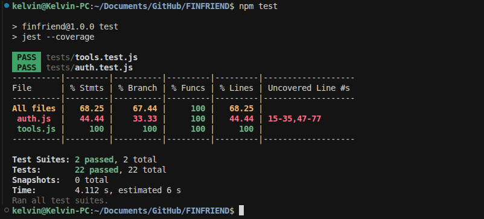

# FinFriend – Software Test Metrics

> The test files referenced here are in the `tests/` folder:
> - `tests/tools.test.js` — 15 test cases for the financial calculators
> - `tests/auth.test.js` — 7 test cases for input validation
> - **Total: 22 test cases**

---

## 1. Test Concepts and Definitions
A **run** is defined as *"the smallest division of work that can be initiated by external intervention on a software component."*
In FinFriend, every API call is a "run." For example:

- Calling `POST /api/tools/budget` with `{ income: 500000 }` is one run
- Calling `POST /api/auth/login` with `{ email: "...", password: "..." }` is one run
- Calling `GET /api/dashboard` from a logged-in user is one run

Runs that use the same input values are called **runs of the same type**. So, all requests to `/api/tools/budget` with `income: 500000` and default percentages are of the same run type.

### Direct vs Indirect Input Variables

**Direct input variables** are things the user directly controls when they make a request.

| Route | Direct Input Variables |
|---|---|
| `POST /api/tools/budget` | `income`, `needs_pct`, `wants_pct`, `savings_pct` |
| `POST /api/tools/loan` | `principal`, `annual_rate`, `months` |
| `POST /api/modules/:slug/quiz` | `answers` object (the user's quiz selections) |
| `POST /api/auth/register` | `full_name`, `email`, `password`, `university` |

**Indirect input variables** are things that influence behavior but the user doesn't directly type them in.

In FinFriend:
- `req.user.id` — this comes from the JWT token, not the request body. It influences which data gets returned from the dashboard, but the user doesn't type their own ID.
- `users.xp` in the database — the quiz route reads this when checking badge thresholds. The student doesn't pass their XP as input; it's already in the database.
- Rate limiting state — the `express-rate-limit` middleware tracks request counts. If a user is close to the 200-request limit, it affects whether the next request succeeds or not.

### What is a Test Case?
A **test case** is defined as *"an instance of a use-case composed of a set of test inputs, execution conditions, and expected results."*

Here is one of our actual test cases from `tests/tools.test.js`:

```javascript
// Test Case: TC-B01
// Use-case: Student uses the budget planner
// Input: income = 500,000 UGX
// Execution conditions: using default 50/30/20 split
// Expected result: needs = 250,000, wants = 150,000, savings = 100,000

test('TC-B01: should return 200 and correct breakdown for valid income', async () => {
  const response = await request(app)
    .post('/api/tools/budget')
    .send({ income: 500000 });

  expect(response.status).toBe(200);
  expect(response.body.needs).toBe(250000);
  expect(response.body.wants).toBe(150000);
  expect(response.body.savings).toBe(100000);
});
```
Every test case in our `tests/` folder follows this pattern: a specific input, specific conditions, and a specific expected output.

---

## 2. Types of Software Tests in FinFriend

### 1. Unit Testing (White Box)
Unit testing checks one small piece of code in isolation from everything else.

In FinFriend, `routes/tools.js` is the perfect candidate for unit testing because it has **zero database calls**. It receives input, does math, and returns a result. Nothing else is involved.

Our 15 tests in `tests/tools.test.js` are unit tests. We create a tiny Express app with just the tools routes and test each calculator function in complete isolation.

```javascript
// We never start the full server.js — just the tools routes
const app = express();
app.use(express.json());
app.use('/api/tools', toolRoutes);
```

### 2. Integration Testing (White Box + Black Box)

Integration testing checks how different parts of the system work together — especially the connections between them.

In FinFriend, integration points exist between:
- `routes/modules.js` → `db/connection.js` (quiz submission writes to `user_progress` and updates `users.xp`)
- `routes/forum.js` → `db/connection.js` (reply posting also updates XP)
- `routes/badges.js` → `db/connection.js` → `users.xp` (reading XP to decide if a badge is earned)

A full integration test for the quiz flow tests: submit quiz → XP updates in DB → badge check runs → badge is awarded. We have not written these yet because they require a real test database, which is the next step.

### 3. External Function Test (System Test / Alpha Test)

This checks that the system implements all its stated features from a user's perspective.

In FinFriend, this involves manually (or automatically) testing:
- Can a student register and log in? ✓
- Can they view and complete a module? ✓
- Can they submit a quiz and see their score? ✓
- Can they track expenses on the dashboard? ✓

These were all done manually.

NOTE: Performance & acceptance testing are not yet performed in FinFriend.

### 4. Installation Testing

Testing the install/setup process.

In FinFriend, the `README.md` documents the setup steps for macOS, Linux, and Windows. These steps are the "installation procedure" for FinFriend.

### 5. Regression Testing

Testing after a change to make sure the change didn't break anything else.

This is where our test files become very useful in the long run. Every time we add a new feature to `routes/tools.js`, we can re-run `npm test` and immediately know if the existing calculator behavior has been broken.

---

## 3. Estimating the Number of Test Cases

```
From time:  N_time = (available hours × number of testers) / (hours per test case)
From cost:  N_cost = available budget / cost per test case
N = min(N_time, N_cost)
```

### Applying This to FinFriend

**From time:**
- FinFriend is a 5-person course project
- Test writing phase: approximately 2 weeks (at about 4 hours per student per week)
- Available hours: 5 students × 2 weeks × 4 hours = **40 hours total**
- Each test case takes about 30 minutes (0.5 hours) to design, write, and verify
- N_time = 40 / 0.5 = **80 test cases**

**From cost:**
We treated "cost budget" as not applicable here since there's no monetary budget for testers in this project.

**Result:** We should target approximately **80 test cases** for a thorough test suite.

We currently have **22 test cases** written (15 for tools, 7 for auth). This is 27.5% of our target, focusing on the most testable and most-used parts of the system (the calculators and the validation layer). The remaining test cases would cover dashboard, forum, modules, badges, and blog routes once a test database is set up.

---

## 4. How We Created Our Test Cases

### Method 1: Equivalence Classes

The idea is to group all possible inputs into classes where the system behaves the same way for every value in that class, and then write one test per class. For the budget calculator, the direct input variable `income` splits into two classes:

| Class | Description | Represents | Test Case |
|---|---|---|---|
| Class 1 (Invalid) | `income <= 0` or missing | Any zero, negative, or absent income value | TC-B03, TC-B04, TC-B05 |
| Class 2 (Valid) | `income > 0` | Any positive number | TC-B01, TC-B02 |

Writing one test for Class 1 (e.g., income = 0) is enough to represent the entire invalid class because the code path is identical for income = -1, 0, or null — they all hit the same `if (!income || income <= 0)` check and return the same 400 error.

We don't need separate tests for income = -5000, income = -1, income = -0.01 because they're all in the same equivalence class.

For the quiz scoring logic in `routes/modules.js`, the `percentage` variable also has two classes:

| Class | Range | Outcome | Where in Code |
|---|---|---|---|
| Failing score | 0% to 59% | `passed = false`, no XP awarded | `routes/modules.js` — `const passed = percentage >= 60` |
| Passing score | 60% to 100% | `passed = true`, XP awarded | Same line |

A test with 55% covers the entire failing class. A test with 70% covers the entire passing class. We don't need tests for every percentage value in between.

### Method 2: Boundary Conditions

Programs are most likely to fail at the edges of their valid ranges. So we specifically test right at the boundary.

In FinFriend, the two most important boundaries are:

**Boundary 1: Income validation in tools.js**
The boundary is at `income = 0`:
- `income = -1` → should fail (invalid, below boundary)
- `income = 0` → should fail (boundary itself, invalid: `<= 0`)
- `income = 1` → should pass (just above boundary, valid)

We test this exact boundary in `TC-B04`:
```javascript
test('TC-B04: should return 400 when income is zero (boundary condition)', async () => {
  const response = await request(app)
    .post('/api/tools/budget')
    .send({ income: 0 });
  expect(response.status).toBe(400);
});
```

**Boundary 2: Quiz pass threshold in modules.js**
The boundary is at `percentage = 60`:
```javascript
// From routes/modules.js
const passed = percentage >= 60;
```
- 59% → fails (just below boundary)
- 60% → passes (exact boundary)
- 61% → passes (just above boundary)

We did not write a code-level test for this, but the boundary is documented: the quiz pass threshold is a hardcoded boundary condition at exactly 60%.

**Boundary 3: Zero interest rate in loan calculator**
The code handles interest rate = 0 with a special branch:
```javascript
const payment = r > 0
  ? Math.round(principal * (r * Math.pow(1 + r, months)) / (Math.pow(1 + r, months) - 1))
  : Math.round(principal / months);
```
- `annual_rate > 0` → compound interest formula
- `annual_rate = 0` → simple division (boundary)

We test this in `TC-L02`:
```javascript
test('TC-L02: should calculate zero interest correctly (boundary condition)', async () => {
  const response = await request(app)
    .post('/api/tools/loan')
    .send({ principal: 1200000, annual_rate: 0, months: 12 });

  expect(response.status).toBe(200);
  expect(response.body.monthly_payment).toBe(100000); // 1,200,000 / 12
  expect(response.body.total_interest).toBe(0);
});
```

### Method 3: Visible State Transitions

In FinFriend, the main state transition for a student learning is:

```
[Not Logged In]
      |
      | POST /api/auth/register
      ↓
[Registered & Logged In] → XP = 0, badges = none
      |
      | GET /api/modules/:slug (view module)
      ↓
[Reading Module]
      |
      | POST /api/modules/:slug/quiz (submit answers)
      ↓
   Pass (≥60%)?
   /           \
  YES           NO
   |             |
   ↓             ↓
[XP Earned]   [No XP, can retry]
   |
   | POST /api/badges/check
   ↓
[Badge Awarded? Only if xp_required threshold crossed]
```

Each arrow in this diagram is a state transition that should be tested. Currently, the transition from "Not Logged In" to "Registered" is partially tested in `tests/auth.test.js` (validation tests). The full state transitions (login → view module → submit quiz → earn badge) would be integration tests.

---

## 5. Allocating Test Time

### By System Component
In FinFriend:

| Component Type | Component | Recommended Test Time |
|---|---|---|
| Developed | `routes/` (8 route modules) | Majority of test time |
| Developed | `middleware/auth.js` | Medium (security-critical) |
| Acquired | `express`, `mysql2`, `bcryptjs`, `jsonwebtoken` | Minimal (trust the library's own tests) |
| Interface | REST API (client ↔ server) | Medium |

We focused our current tests on `routes/tools.js` (developed, no external dependencies) and the validation layer of `routes/auth.js` (security-critical).

### By Test Type
- For a first release: feature tests first, then load tests
- `routes/tools.js` gets feature tests (our 15 tests)
- `routes/auth.js` gets feature tests for validation (our 7 tests)
- Load testing (sending 200 requests in 15 minutes to hit the rate limit) is not done yet

### By Operational Mode
In FinFriend, the most-used routes based on typical student behavior:

| Route | Estimated Usage | Priority |
|---|---|---|
| `GET /api/dashboard` | 15% of all requests | High |
| `GET /api/modules` | 12% | High |
| `GET /api/modules/:slug` | 10% | High |
| `POST /api/tools/budget` | 6% | Medium |
| `POST /api/tools/investment` | 5% | Medium |
| `POST /api/tools/loan` | 5% | Medium |
| `POST /api/auth/login` | 4% | Medium |
| Others | 43% | Lower |

The calculators (tools) make up about 16% of expected traffic but are pure computation — high reliability, easy to test. We prioritized them first.

---

## 6. Test Coverage Metrics
### Statement Coverage (CVs)

```
CVs = (number of statements tested / total statements) × 100%
```

For `routes/tools.js` specifically (the file our tests focus on), we achieve very high statement coverage because our tests cover both the valid path and the invalid path for every endpoint.

**Statement coverage estimate for tools.js:**

| Path | Covered? | Test Case |
|---|---|---|
| `const { income, ... } = req.body` | ✓ | TC-B01 |
| `if (!income \|\| income <= 0)` | ✓ | TC-B01, TC-B03 |
| `return res.status(400).json(...)` | ✓ | TC-B03, TC-B04, TC-B05 |
| `res.json({ income, needs, wants, savings, breakdown })` | ✓ | TC-B01 |
| Investment: all 3 required-field checks | ✓ | TC-I03, TC-I04, TC-I05 |
| Investment: future value calculation | ✓ | TC-I01, TC-I02 |
| Loan: zero interest branch | ✓ | TC-L02 |
| Loan: compound interest branch | ✓ | TC-L01 |

Estimated statement coverage for `routes/tools.js`: **≈ 95%**

```
Estimated project-wide CVs ≈ (tools.js + auth validation) / total lines
                           ≈ (68 + ~20) / 1291 × 100 ≈ 6.8%
```

This is expected and honest. Improving project-wide coverage requires a test database setup.

### Branch Coverage (CVb)

```
CVb = (number of branches tested / total branches) × 100%
```
A branch is any point in the code where there are two possible paths (if/else, ternary operator).

**For tools.js specifically:**

The branches in tools.js and whether we cover both sides:

| Branch | True Path Tested? | False Path Tested? |
|---|---|---|
| `if (!income \|\| income <= 0)` in budget | ✓ TC-B03 | ✓ TC-B01 |
| `if (!principal \|\| !annual_rate \|\| !years)` in investment | ✓ TC-I03 | ✓ TC-I01 |
| `if (!principal \|\| !annual_rate \|\| !months)` in loan | ✓ TC-L03 | ✓ TC-L01 |
| `r > 0` ternary in loan calculation | ✓ TC-L01 | ✓ TC-L02 |

Branch coverage for tools.js: **≈ 100%** — both sides of every decision are tested.

### Component Coverage (CVcm)

```
CVcm = (number of route modules tested / total route modules) × 100%
```

| Route Module | Tested? | Type of Testing |
|---|---|---|
| `routes/tools.js` | ✓ | Full (15 tests) |
| `routes/auth.js` | ✓ (partial) | Validation only (4+3 tests) |
| `routes/modules.js` | ✗ | Not yet |
| `routes/dashboard.js` | ✗ | Not yet |
| `routes/forum.js` | ✗ | Not yet |
| `routes/blog.js` | ✗ | Not yet |
| `routes/badges.js` | ✗ | Not yet |
| `routes/users.js` | ✗ | Not yet |

```
CVcm = 2 / 8 × 100 = 25%
```

Component coverage is currently **25%**. The remaining 6 modules need a test database to be properly tested.

### GUI Coverage (CVGUI)

```
CVGUI = (number of GUI elements tested / total GUI elements) × 100%
```

FinFriend has 15 HTML pages in `public/`. Each page has interactive elements (forms, buttons, filters, modals).

Currently our automated tests only test API endpoints, not the HTML pages or their interactive elements. GUI testing would involve tools like Playwright or Cypress to simulate a real browser clicking buttons and filling forms.

Major GUI elements that are NOT yet automatically tested:

| Page | Untested GUI Elements |
|---|---|
| `tools.html` | 3 forms (budget, investment, loan) with submit buttons |
| `module.html` | Quiz radio buttons, "Take Quiz" button, "Mark Complete" button |
| `dashboard.html` | Add Expense modal, Add Goal modal, progress bars |
| `register.html` | University dropdown, all input fields |
| `forum.html` | New Thread modal, category filter buttons |

GUI coverage: **0% automated** (all currently manual)

---

## 7. Test Pass, Failure, and Pending Rates

### After Running `npm test`



The screenshot shows 2 test suites and 22 individual tests all passing in green.

Based on our 22 test cases, here are the results:

```
Test Suites: 2 passed, 2 total
Tests:       22 passed, 22 total
Snapshots:   0 total
```

### Test Pass Rate (Rtp)

```
Rtp = (test cases passed / total test cases) × 100%
    = (22 / 22) × 100
    = 100%
```

All 22 test cases pass. This means every behavior we tested matches what the code actually does.

### Test Failure Rate (Rtf)

```
Rtf = (test cases failed / total test cases) × 100%
    = (0 / 22) × 100
    = 0%
```

### Test Pending Rate (Rtpend)

```
Rtpend = (test cases pending / total test cases) × 100%
       = (0 / 22) × 100
       = 0%
```

### What These Numbers Mean

A 100% pass rate on 22 tests means: the parts of FinFriend that we tested work exactly as expected. However, a 100% pass rate on only 22 tests is not the same as the whole system being bug-free. It means we have good confidence in the calculator logic and the input validation layer. The remaining 6 route modules are untested.

The target is to expand to 80 test cases (as estimated in Section 3) to improve confidence in the full system.

---

## 8. Software Testability Metrics
**Testability** is defined as how easily you can control and observe what a piece of code does during testing.

The key formula is:

```
TC = (1/n) × Σ TC_BCS_i

Where:
  n = number of Boolean Control Statements (BCS) in the component
  TC_BCS = 1 if the BCS is independently determinable (input-controlled)
  TC_BCS = 0 if the BCS depends on internal state or database results
```

### Calculating TC for routes/tools.js

In `routes/tools.js`, every decision (BCS) depends **only** on the incoming request body — a direct input variable. There are no database calls, no reading from `req.user`, nothing from memory.

| BCS in tools.js | Depends On | TC_BCS |
|---|---|---|
| `if (!income \|\| income <= 0)` | `req.body.income` (direct input) | 1 |
| `if (!principal \|\| !annual_rate \|\| !years)` | `req.body.*` (direct inputs) | 1 |
| `r > 0` (ternary in loan) | `req.body.annual_rate` (direct input) | 1 |
| `if (!principal \|\| !annual_rate \|\| !months)` | `req.body.*` (direct inputs) | 1 |

```
TC (tools.js) = (1+1+1+1) / 4 = 1.0
```

**Testability score = 1.0** — perfectly controllable. This confirms tools.js is the right place to start testing.

### Calculating TC for routes/modules.js (quiz endpoint)

In `routes/modules.js`, the quiz submission handler has several BCS that depend on database query results:

| BCS in quiz handler | Depends On | TC_BCS |
|---|---|---|
| `if (!mod.length)` | DB query result for module | 0 |
| `if (answers[q.id] && answers[...] === q.correct)` | DB result for correct answers | 0 |
| `const passed = percentage >= 60` | Calculated from DB result | 0 |
| `if (passed)` | Calculated from DB result | 0 |

```
TC (quiz handler) = (0+0+0+0) / 4 = 0.0
```

**Testability score = 0.0** — not independently testable without a real database or mocking. This is why we didn't write tests for it yet.

### Testability Across Routes

| Module | TC Score | Reason |
|---|---|---|
| `routes/tools.js` | **1.0** | Pure math, no DB |
| `middleware/auth.js` | **1.0** | Input only (JWT token from header) |
| `routes/auth.js` (validation) | **1.0** | Returns 400 before any DB call |
| `routes/blog.js` | **0.0** | All responses depend on DB data |
| `routes/forum.js` | **0.0** | Thread content comes from DB |
| `routes/modules.js` | **0.0** | Module content, quiz answers from DB |
| `routes/dashboard.js` | **0.0** | All data aggregated from DB |
| `routes/badges.js` | **0.0** | XP thresholds come from DB |

The modules with TC = 0.0 are testable, but they require either a real test database or mocking the database calls with something like `jest.mock('../db/connection')`.

---

## 9. Remaining Defects Estimation
The **fault seeding** method is used to estimate how many bugs are still hiding in the code.

The idea is:
1. Deliberately inject (seed) `Ns` known faults into the code
2. Have a tester find as many bugs as possible
3. Count how many seeded faults they found (`nsd`)
4. Count how many non-seeded (real) faults they found (`nd`)
5. Use the formula to estimate remaining real bugs (`Nr`)

```
Formula:
  Nr = (nd × Ns) / nsd
  Undetected = Nr - nd
```

### Applying This to FinFriend

We have not formally done fault seeding, but here is how it would work for `routes/tools.js`:

**Step 1: Seed faults**

We make deliberate mistakes in the code, for example:
- Change `income <= 0` to `income < 0` (so income = 0 would be accepted instead of rejected)
- Change `percentage >= 60` to `percentage > 60` (so exactly 60% would fail instead of pass)
- Change `Math.round(principal / months)` to `Math.floor(principal / months)`

Say we seed `Ns = 5` faults.

**Step 2: Run a tester on it**

Have someone run the tests without knowing which faults were seeded.

Hypothetical result: `nsd = 3` seeded faults found, `nd = 2` real non-seeded bugs found.

```
Nr = (2 × 5) / 3 = 3.33 ≈ 4 remaining real bugs
Undetected real bugs = 4 - 2 = 2
```

This means even after the tester found 2 real bugs, we estimate about 2 more are still hiding.

### Phase Containment Effectiveness (PCE)
**PCE** measures how good we are at catching bugs within the phase they were created in, rather than letting them escape to the next phase.

```
PCE = (defects removed at this phase / (defects existing on entry + defects injected during phase)) × 100%
```

For FinFriend's development history (estimated):

| Phase | Defects Injected | Defects Removed | PCE |
|---|---|---|---|
| Design | ~5 (structural issues) | ~4 (caught in code review) | 4/(0+5) = 80% |
| Coding | ~12 (logic/validation bugs) | ~10 (found during manual testing) | 10/(1+12) = 76.9% |
| Testing | ~2 (edge cases) | ~2 (found by our Jest tests) | 2/(2+2) = 50% |

The PCE for our testing phase is lower because we only have 22 test cases covering limited scope. As we expand our test suite, more defects will be caught in the testing phase rather than slipping through to production.

---

## 10. Test Metrics Coverage Map

| Test concept | FinFriend Application | File / Location |
|---|---|---|
| Run definition | Each API call (e.g., `POST /api/tools/budget`) | `routes/tools.js`, all route files |
| Direct input variables | `req.body` fields (income, principal, email, etc.) | `routes/tools.js`, `routes/auth.js` |
| Indirect input variables | `req.user.id` from JWT, `users.xp` from DB | `middleware/auth.js`, `routes/modules.js` |
| Test case definition | Input + conditions + expected result | `tests/tools.test.js`, `tests/auth.test.js` |
| Unit testing | `routes/tools.js` (no DB, pure math) | `tests/tools.test.js` (15 tests) |
| Integration testing | Quiz → XP → Badge flow | Pending (needs test DB) |
| System testing | Full deployment test | Manual testing during development |
| Acceptance testing | Target: Ugandan university students | `public/about.html` |
| Regression testing | Re-run `npm test` after any code change | All test files |
| Test case estimation | ~80 test cases recommended (time-based) | Section 3 of this document |
| Equivalence classes | Valid vs invalid income, pass vs fail quiz score | `tests/tools.test.js`, `routes/modules.js` |
| Boundary conditions | `income = 0`, `percentage = 60`, `annual_rate = 0` | TC-B04, TC-L02 |
| State transitions | Register → Login → Quiz → Badge flow | `public/module.html` — chained calls |
| Statement coverage | ~95% for tools.js, ~6.8% project-wide | `tests/tools.test.js` |
| Branch coverage | ~100% for tools.js | `tests/tools.test.js` |
| Component coverage | 2/8 = 25% | `tests/tools.test.js`, `tests/auth.test.js` |
| GUI coverage | 0% automated | Pending browser testing |
| Test pass rate | 22/22 = 100% | Output of `npm test` |
| Test fail rate | 0/22 = 0% | Output of `npm test` |
| Test pending rate | 0/22 = 0% | Output of `npm test` |
| Testability (TC) | 1.0 for tools.js, 0.0 for DB-dependent routes | Section 8 of this document |
| Remaining defects | Fault seeding example provided | Section 9 of this document |
| PCE | Estimated at 76-80% for coding phase | Section 9 of this document |
